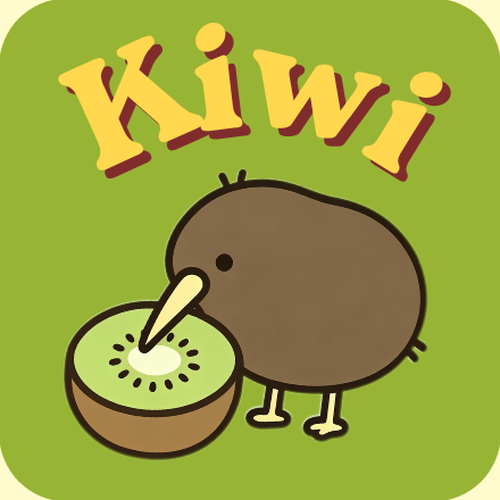

<p align="center">
  
</p>

<h1 align="center">Kiwi</h1>

<p align="center">
  一只住在 macOS 桌面上的原生 Kiwi 桌宠。<br>
  陪你工作、提醒喝水和活动，也能同步 Codex 任务与飞书日历。
</p>

<p align="center">
  <a href="https://github.com/tacotacoqw/Kiwi/releases/download/v0.1.0/Kiwi-0.1.0-macOS-universal.pkg"><strong>下载 Kiwi 0.1.0</strong></a>
  ·
  <a href="https://github.com/tacotacoqw/Kiwi/releases">全部版本</a>
  ·
  <a href="#使用教程">使用教程</a>
</p>

<p align="center">
  
</p>

## 简介

Kiwi 是一个使用 Swift、AppKit 与 Apple Vision 开发的原生 macOS
桌面宠物。它会在桌面上呼吸、眨眼、散步和回应点击，也可以通过本机摄像头
判断你是否长时间坐在电脑前，并在合适的时候提醒你站起来活动或喝水。

除了桌宠功能，Kiwi 还可以读取 Codex 本机任务事件，在 AI Coding
进行时提供休息活动；也可以连接飞书日历，在日程临近时通过动画、声音和文字提醒你。

## 下载安装

### 系统要求

- macOS 13 Ventura 或更高版本
- Apple Silicon 或 Intel Mac
- 摄像头为可选功能；不开启也可以使用桌宠、日历和任务陪伴功能

### 安装步骤

1. 下载
   [Kiwi-0.1.0-macOS-universal.pkg](https://github.com/tacotacoqw/Kiwi/releases/download/v0.1.0/Kiwi-0.1.0-macOS-universal.pkg)。
2. 双击安装包并按提示完成安装，Kiwi 会自动放入“Applications / 应用程序”。
3. 从 Finder 的“应用程序”中启动 Kiwi。

> [!IMPORTANT]
> 当前应用使用临时代码签名，安装包尚未经过 Apple Developer ID 签名与公证。
> 若 macOS 拦截安装，请在 Finder 中右键安装包并选择“打开”；第一次启动 Kiwi
> 若再次出现安全提示，请在“应用程序”中右键 `Kiwi.app`，选择“打开”。
> 请只从本仓库的 Releases 页面下载安装包。

安装包 SHA-256：

```text
a8df23f0a087faecbc51c3835e53023e06612032c07d2309e38dbf05dcea3bd1
```

## 主要功能

### 桌面宠物

- 透明、置顶、可拖动的桌宠窗口，可跨桌面显示
- 呼吸、眨眼、好奇、抖身、探头和多套散步动画
- 接近屏幕边缘时自动转向，显示器变化后自动回到可见区域
- 遵循 macOS“减少动态效果”无障碍设置
- 菜单栏常驻，不占用 Dock

### 健康提醒

- 可分别设置久坐活动提醒与喝水提醒，默认间隔均为 45 分钟
- 使用 Apple Vision 在本机判断是否持续坐在电脑前
- 可识别站立与喝水动作，完成后自动开始下一轮计时
- 30 秒未响应时，Kiwi 会从屏幕边缘探出并持续提醒
- 提供“10 秒体验久坐提醒”，无需等待完整间隔即可预览

### Codex 任务陪伴

- 优先读取 Codex 本机 `task_started` / `task_complete` 事件
- 任务开始后开放随机休息活动，包括短视频、喂食、敲木鱼与计时休息
- 任务超过 5 分钟会更新提醒，超过 10 分钟会切换到长视频
- 完成后显示处理耗时，也可选择发送飞书手机通知
- 本机事件不可用时，可在已有系统权限的前提下使用画面识别作为后备

### 飞书日历

- 飞书用户 OAuth 登录，授权与刷新令牌保存在 macOS 钥匙串
- 同步未来 24 小时日程，展示下一项任务
- 支持自定义提前提醒时间和重复提醒间隔
- 可创建测试日程并向指定用户发送飞书通知

### 隐私优先

- 摄像头画面只在本机内存中处理，不保存、不上传
- 画面识别严格按“捕获一帧、识别一帧、立即释放”运行
- Kiwi 不会主动申请屏幕录制权限，也不会自动打开系统设置
- 飞书 App Secret 与 OAuth 令牌保存在 macOS 钥匙串

## 使用教程

### 1. 认识 Kiwi

启动后，Kiwi 会直接出现在桌面，同时在菜单栏显示一个小 Kiwi 图标。

- **拖动 Kiwi**：按住它并拖到喜欢的位置。
- **单击 Kiwi**：展开“状态、散步、日历、喂食”快捷按钮。
- **双击 Kiwi**：让它立即起来散步。
- **右键 Kiwi**：直接打开完整后台菜单；菜单栏拥挤时也可使用。
- **找回 Kiwi**：从菜单栏选择“显示 Kiwi”。
- **退出**：从菜单栏选择“退出 Kiwi”。

### 2. 设置久坐和喝水提醒

1. 点击菜单栏中的 Kiwi 图标。
2. 分别为“活动提醒”和“喝水提醒”选择常用间隔，或输入
   1–720 分钟的自定义时间。
3. 开启摄像头监测；首次使用时允许 macOS 摄像头权限。
4. 可先选择“10 秒体验久坐提醒”检查动画、声音与动作识别。

摄像头开启时，macOS 会显示系统级绿色隐私指示点。这是系统行为，
Kiwi 无法隐藏。

### 3. 使用 Codex 任务陪伴

1. 从菜单栏打开“Codex 任务监测”。
2. 开启任务监测后，正常在 Codex 中开始任务即可。
3. Kiwi 会优先读取本机任务生命周期事件，不需要屏幕录制权限。
4. 任务进行期间可在休息弹窗中切换抖音短视频或自选 B 站视频。
5. 在“B站自选视频”中粘贴完整链接或 BV 号，即可保存自己的默认视频。

### 4. 连接飞书日历

快速入口：
[飞书开放平台开发者后台](https://open.feishu.cn/app?lang=zh-CN) ·
[官方“创建并配置应用”教程](https://open.feishu.cn/document/mass-messaging-to-designated-departments/create-app-request-permission) ·
[官方日历同步说明](https://open.feishu.cn/document/best-practices/calendarsync)

1. 打开[飞书开发者后台](https://open.feishu.cn/app?lang=zh-CN)，登录后点击
   “创建企业自建应用”。如果看不到此按钮，需要让企业管理员授予创建应用的权限。
2. 进入新应用，在“凭证与基础信息”中复制 App ID 和 App Secret。
   App Secret 不要发到聊天或提交到 Git 仓库。
3. 进入“应用能力 → 添加应用能力”，添加并启用“机器人”。
4. 进入“权限管理 → API 权限”，开通以下权限：
   - 获取日历、日程及忙闲信息（`calendar:calendar:readonly`）
   - 更新日历及日程信息
   - 离线访问用户资源（`offline_access`）
   - 以应用的身份发消息（`im:message:send_as_bot`）
5. 进入“安全设置 → 重定向 URL”，添加：
   `http://127.0.0.1:17653/feishu/oauth/callback`。
6. 进入“版本管理与发布”，创建版本并提交发布；权限只有在应用版本生效后
   才能被 Kiwi 使用。
7. 打开 Kiwi 菜单栏中的“飞书日历 → 连接与提醒设置…”。
8. 填写 App ID、App Secret 和接收提醒用户的 Open ID。
   Calendar ID 通常可以留空。
9. 点击“登录飞书授权”，完成授权后选择“保存并测试连接”。

连接成功后，Kiwi 每分钟同步一次未来 24 小时的日程，并在本机检查提醒时机。

## 从源码构建

需要 macOS、Xcode Command Line Tools 与 Swift 5.9 或更高版本。

```bash
git clone https://github.com/tacotacoqw/Kiwi.git
cd Kiwi

# 运行测试
swift test --disable-sandbox

# 构建 Apple Silicon + Intel 通用应用
./scripts/build-app.sh
open dist/Kiwi.app

# 制作 DMG
./scripts/package-dmg.sh

# 制作自动安装到“应用程序”的 PKG（推荐分发）
./scripts/package-pkg.sh
```

构建结果不会提交到 Git；应用和安装包位于 `dist/`。

## 项目结构

```text
Kiwi/
├── Assets/                 # 图标、动画帧、音效与预览
├── Sources/KiwiPet/        # AppKit 应用源码
├── Tests/KiwiPetTests/     # 行为、提醒和界面逻辑测试
├── scripts/                # 素材处理、构建与安装包脚本
├── Info.plist              # macOS 应用元数据与权限说明
└── Package.swift           # Swift Package 配置
```

## 反馈

遇到问题或有功能建议，欢迎提交
[Issue](https://github.com/tacotacoqw/Kiwi/issues)。
